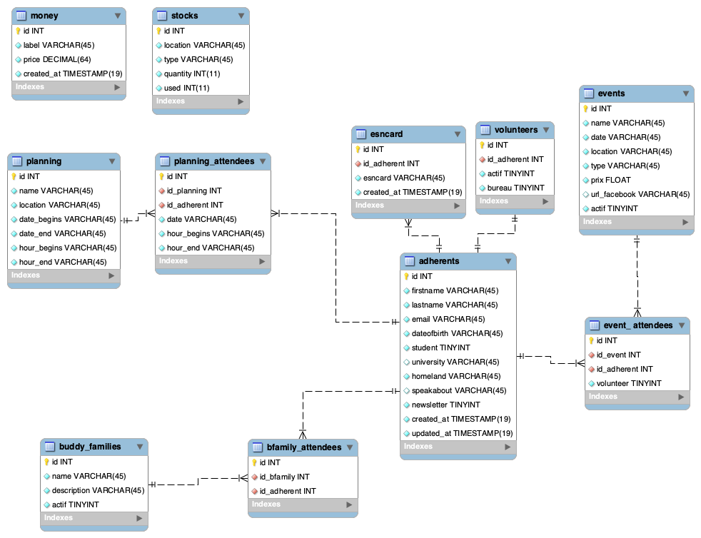

# sAPI

## Table of Contents

- [Setup](#setup)
- [API Documentation](#api-documentation)
  - [HealthCheck](#healthcheck)
  - [Authentication](#authentication)
- [Annexes](#annexes)
  - [Database](#database)

## Setup

The api is made in `Golang` aka `Go` and can be use from source or using `Docker`.

- **Helper**

```bash
Usage of /usr/local/bin/sAPI:
    -conf string
        path for the configuration file. (default "test/conf_local.yaml")
    -swagger string
        relative path for the swagger file. (default "/swagger.yaml")
```

- **Build**

```bash
docker build . -f docker/Dockerfile --tag sapi:latest
```

- **Run**

```bash
docker run -v $PWD/conf/folder:/etc/sAPI/conf -p 8080:8080 sapi:latest \
    -conf=/etc/sAPI/conf/conf_docker.yaml
```

## API Documentation

- A build-in interactive documentation is openly available at the `/docs` endpoint.
- The build-in swagger is available at the `/swagger` endpoint.

### HealthCheck

- The healthcheck is available at the `/health` endpoint.

### Authentication

A session token is need to acceed to each endpoint of the API and to use the swagger.

### New endpoints / modules

To create a new endpoints, check the [documentation module](modules/README.md).

## Annexes

### Database

The db schema is available in [database/sapi_db.mwb](database/sapi_db.mwb).
It can be edit with [MySQL Workbench](https://www.mysql.com/products/workbench/).



:warning:
> Actually the db creation is coded by hand.
> But in a near future we would like to generated it automatically.
