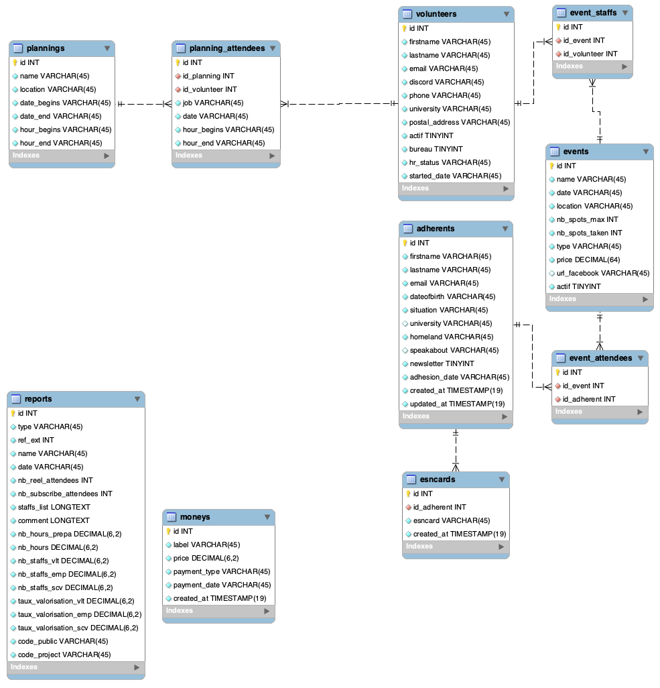

# The Go(smo) API


*Gopher image by [Renee French][rf], licensed under [Creative Commons 3.0 Attributions license][cc3-by].*

# Table of Contents

- [Setup](#setup)
- [API Documentation](#api-documentation)
  - [HealthCheck](#healthcheck)
  - [Authentication](#authentication)
  - [New endpoints / modules](#new-endpoints--modules)
  - [Contributing](#contributing)
- [Annexes](#annexes)
  - [Database](#database)

# Setup

The api is made in `Golang` aka `Go` and can be use from source or using `Docker`.
- In order to run correctly, its need a database running, the database information are [`conf_local.yaml`](test/conf_local.yaml) or [`conf_docker.yaml`](test/conf_docker.yaml)
- Some vars are also need :

```
export PASS_DB=root
export TOKEN_API_TEST=test
```

Then you can run the apps using following commands or using the make command using the [local `makefile`](makefile).

- **Helper**

```bash
Usage :
    -conf string
        path for the configuration file. (default "test/conf_local.yaml")
    -swagger string
        relative path for the swagger file. (default "/swagger.yaml")
```

- **Build**

```bash
make docker-build
```

- **Run**

```bash
make docker-run
```

# API Documentation

- A build-in interactive documentation is openly available at the `/docs` endpoint.
- The build-in swagger is available at the `/swagger` endpoint.

## HealthCheck

- The healthcheck is available at the `/health` endpoint.
- The status resume is available at the `/auth/status` endpoint.
- The profile resume is available at the `/auth/profile` endpoint.

## Galaxy CAS

A connexion with the galaxy is available in the [coCAS module](cocas/README.md).

## Authentication

A session token is need to acceed to each endpoint of the API and to use the swagger.

## New endpoints / modules

To create a new endpoints, check the [documentation module](modules/README.md).

## Contributing

If you want to contribute to the project, please referred yourself at the [contributing doc](CONTRIBUTING.md).

# Annexes

## Database

The db schema is available in [database/cosmoappy_db.mwb](database/cosmoappy_db.mwb).
It can be edit with [MySQL Workbench](https://www.mysql.com/products/workbench/).



> ⚠ Actually the db creation is coded by hand.
> But in a near future we would like to generated it automatically.
